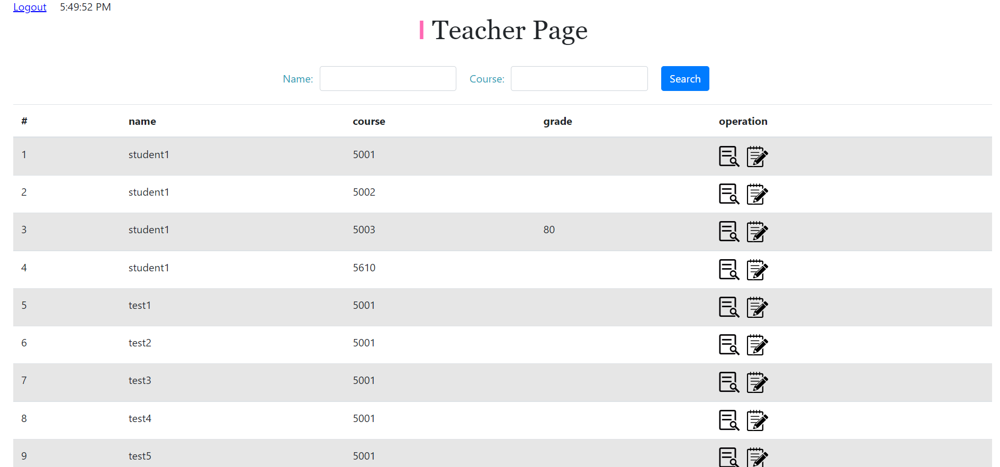
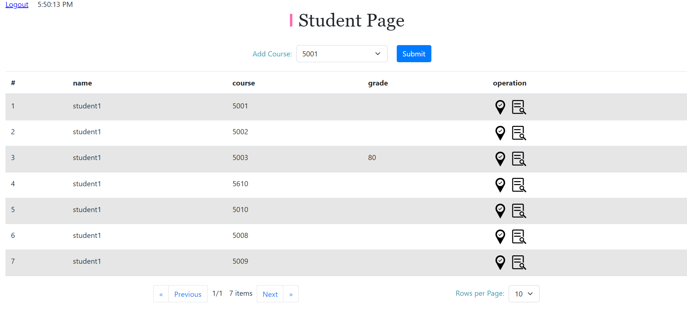
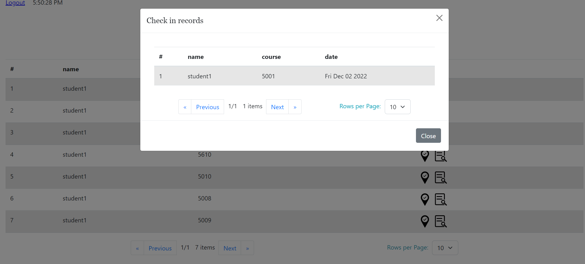
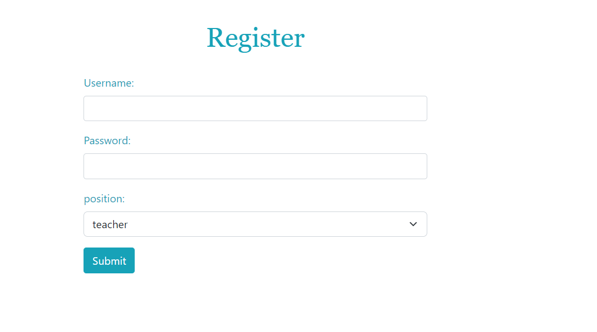
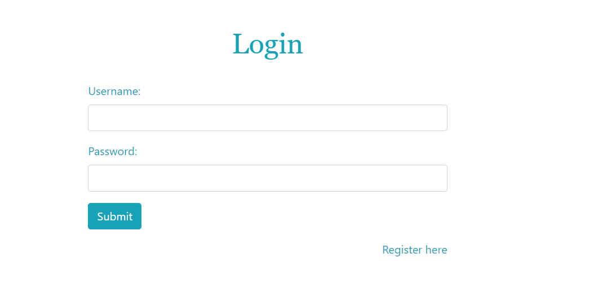

# Always On Time - Simple attendance tracking system

## Propose:

It is always a painful and repetitive task to track students' attendance manually in class. In this project, we are going to create an educational attendance system to track the attendance of the students. The main objective of this project is to keep a track of students' attendance and let faculty get detailed reports of students for better academic management. The attendance system can provide a quick, easy, and transparent view of the classes and students. Our application will improve the overall management efficiency and make sure each student will be taken care of in time.

## Milestones for class:

- \*\*60% progress: First we discussed our design mockups about what functionalities we are going to provide and what each page should looks like. Then, We initialized our project with an basic MERN structure. We successfully connected our database with MongoDB Atlas. We can successfully send and received data from our database and correctly display on localhost. We also complete our basic structure of routing and the draft frontend page so we can check if we can display the data at the right place.

- \*\*80% progress: This part we are mainly focused on our frontend. We created our teacher and student page with JavaScript and React hooks an to achieve basic functionalities such as letting the teacher to add courses and view student's attendance status. The student can add courses and check-in for certain course for attendance reference.

## Install, Build & Run

Use yarn or npm

1. Clone this repository.
2. Run 'npm i'.
3. Run 'node start'.
4. In the web browser of your choice, go to [http://localhost:3000/](http://localhost:3000/)

## Design Documents

- Description and user stories: https://docs.google.com/document/d/12V1P8yGPkhpSFf-dfbj4vnjPKYjAc06nRRu3WkD9qec/edit?usp=sharing
- Design mockup: https://www.figma.com/file/SeZmeSeuku920XDQ0dvYYT/P2?node-id=0%3A1&t=AWxRZibqbvMk9w8P-1
- Presentation Slides: https://docs.google.com/presentation/d/1dNCW6HOd5D2e5dw98cOePedNqozdg-yi5-T0WrEOO34/edit?usp=sharing
- Userbility Study Report: https://docs.google.com/document/d/1k-NlNRZ6Vt5pG_wg8nM8XRwO5_cKi-pqYIzbPZ5aZlY/edit#
## Authors

Yunxiao Li && Tianyu Lu

## color theme

## Screen Shots

1. Teacher Page

   

2. Student Page 

   

3. Student check in

   

4. Login Page

   

5. Register Page

   
   
## V2 Improvements
1. Modified the errors and warnings in the axe, added contrast and so on
2. Added keyboard control, now you can use tab and shift+tab to control all functional elements
3. Change the password into a secret text
4. Improved the display effect on mobile
5. Add customized icon

## Future Improvements
1. Make UI better (eg. add background pictures). 
2. Make student record more intuitive and straightforward.
3. Add location info as check-in for the better accuracy.  

## Course Link
- https://johnguerra.co/classes/webDevelopment_fall_2022/
## Check It Out
- https://alwaysontime2.herokuapp.com/
